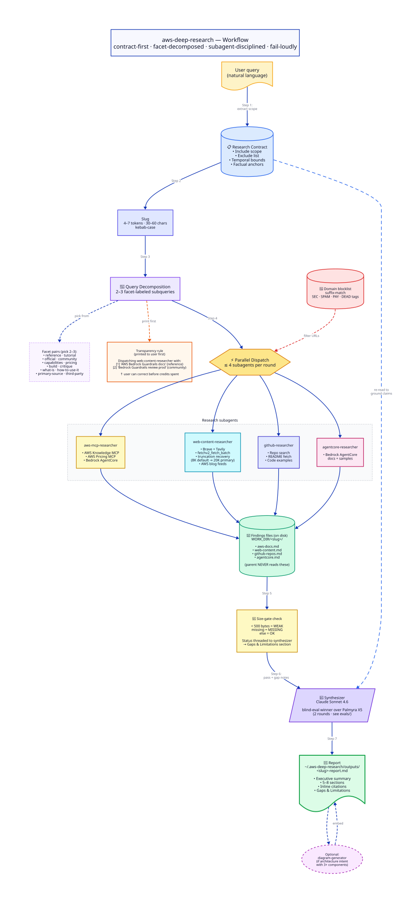

# :mag: aws-deep-research

[](https://skills.sh/praveenc/skills)

Multi-source, parallelized deep research with facet-based query decomposition,
subagent dispatch, and synthesized citations.

**Optimized for AWS topics** (dispatches specialist subagents against AWS
Knowledge MCP, AWS Pricing MCP, Bedrock AgentCore docs, AWS blog feeds,
GitHub, and the open web) **but works equally well on non-AWS / generic
research queries** - library internals, software architecture patterns,
methodology deep-dives, cross-vendor comparisons, and primary-source
research (papers, gists, blog posts).

The skill auto-classifies each query as `aws` or `generic` in Step 1 and
routes to appropriate sources; non-AWS queries fall through to web search +
GitHub with the same facet-decomposition and contract-first discipline.

## Install

```bash
npx skills add https://github.com/praveenc/skills --skill aws-deep-research
```

## How it works

<p align="center">
  
</p>

<p align="center"><sub>
  <a href="./docs/workflow.svg">Open full-size SVG</a> &middot;
  <a href="./docs/workflow.d2">View D2 source</a>
</sub></p>

The eight-step flow enforced by `SKILL.md`:

1. **Research contract** grounds every claim (scope, exclusions, factual anchors)
2. **Facet-labeled decomposition** (2-3 subqueries per source, printed to the user before any API credit is spent)
3. **Domain blocklist** filters URLs pre-fetch
4. Up to **4 subagents dispatch in parallel** writing findings to disk (never into the parent's context)
5. **Size-gate** catches silent failures
6. **Synthesizer** re-reads the contract to ground all citations in the final report

## Example queries

```
# AWS-centric
> How does Bedrock AgentCore compare to Strands Agents SDK?
> Cost-optimize a serverless RAG pipeline on Bedrock + OpenSearch
> Review best practices for Bedrock Guardrails in production

# Cross-vendor / comparative
> Disaggregated inference: NVIDIA Rubin CPX vs Groq LPU vs AWS Trainium
> Compare AWS Bedrock vs Azure OpenAI vs Vertex AI for enterprise RAG

# Non-AWS / generic
> What is Karpathy's LLM knowledge-base pattern and how do I adapt
  an Obsidian vault?
> Circuit breaker pattern in distributed systems - production lessons
> Context engineering for agents: write, select, compress, isolate
```

## Configuration

The skill uses these keys (all optional; it gracefully degrades):

| Variable | Purpose | Free tier |
|---|---|---|
| `BRAVE_SEARCH_API_KEY` | Web search | 2,000 queries/month |
| `TAVILY_API_KEY` | Alternate web search | 1,000 queries/month |
| `GITHUB_TOKEN` | Higher GitHub API rate limits | 5,000/hr with token vs 60/hr without |
| AWS credentials (via `~/.aws/config` or env) | AWS docs + pricing + Bedrock AgentCore MCP | - |

Copy `scripts/.env.example` to `scripts/.env` and populate the keys you need.

## Artifacts

Research artifacts write to `~/.aws-deep-research/work/<slug>/` and final
reports to `~/.aws-deep-research/outputs/`. Override via `RESEARCH_WORK_DIR` /
`REPORT_OUTPUT_DIR` in `.env`.

## Eval

Synthesizer backend choice (Sonnet 4.6 vs Palmyra X5) was decided via two
blind-read rounds with the evaluator unable to see the model label. See
[evals/palmyra-vs-claude/SPIKE_SUMMARY.md](./evals/palmyra-vs-claude/SPIKE_SUMMARY.md)
for the full evaluation.

## Full documentation

See [SKILL.md](./SKILL.md) for the complete workflow specification.
